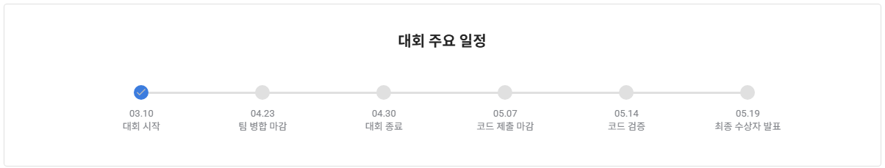

# 신용카드 고객 세그먼트 분류 AI 경진대회

`알고리즘` | `월간 데이콘` | `정형` | `금융` | `분류` | `F1 Score`

상금 : 데이스쿨 프로 구독권

기간 : 2025.03.10 ~ 2025.04.30 09:59

URL : https://dacon.io/competitions/official/236460/overview/agreement

## 개요
### 배경
안녕하세요, 데이커 여러분 :) 

금융산업의 디지털 전환과 함께 카드사 고객 데이터의 중요성이 날로 커지고 있습니다. 

고객의 다양한 금융 활동 데이터를 분석하여 신용카드 고객 세그먼트(Segment)를 예측함으로써 카드사의 마케팅 전략 및 고객 관리에 큰 도움이 될 수 있습니다. 

이번 경진대회에서는 금융 데이터를 활용해 고객 별 일정 기간의 데이터를 바탕으로 카드사 신용카드 고객 세그먼트(Segment) 분류하는 AI 알고리즘을 개발하는 것을 목표로 합니다. 

여러분은 고객의 신용정보, 승인매출, 청구, 잔액, 채널, 마케팅, 성과 등 다양한 데이터를 바탕으로 각 고객들의 세그먼트(Segment) 분류을 예측하는 모델을 설계하게 됩니다. 

신용카드 고객 세그먼트(Segment)를 정확하게 분류할 수 있는 AI 알고리즘을 개발하여 고객 맞춤형 서비스 제공에 기여해 보세요! 

### 주제
신용카드 고객 세그먼트 분류 AI 알고리즘 개발

### 설명
일정 기간동안의 고객 신용정보, 승인매출, 청구, 잔액, 채널, 마케팅, 성과 등 다양한 데이터를 바탕으로 신용카드 고객 세그먼트(Segment) 분류 AI 알고리즘 개발

### 주최 / 주관 / 후원
주최 / 주관: 데이콘

후원: 한국지능정보사회진흥원(NIA)

### 참가 대상
데이커라면 누구나 참가 가능

## 규칙
### 1. 리더보드
평가 산식 : Macro F1-Score

Public Score : 전체 테스트 데이터 중 50%

Private Score : 전체 테스트 데이터 중 100%

### 2. 평가
1차 평가: 리더보드 Private Score

2차 평가: Private Score 상위 10팀 코드 및 PPT 제출 후 코드 검증

### 3. 참여
개인 또는 팀을 이루어 참여할 수 있습니다.

단체 혹은 기관 참여시 별도의 절차가 필요합니다. (More > 공지사항> 게시글 확인)

개인 참가 방법: 팀 신청 없이, 자유롭게 제출 창에서 제출 가능

팀 구성 방법: 팀 페이지에서 팀 구성 안내 확인

팀 최대 인원: 5 명

                   * 동일인이 개인 또는 복수팀에 중복하여 등록 불가.

1일 제출 가능 횟수: 5회
 

### 4. 외부 데이터 및 사전 학습 모델
외부 데이터 사용 금지: 경진대회 제공 데이터 외에는 사용할 수 없습니다.

공식 공개 사전 학습 모델 사용 가능: 가중치 파일이 공식적으로 공개되고 사용에 법적 제약이 없는 사전 학습 

모델은 사용할 수 있습니다.

### 5. 코드 및 PPT 제출 규칙
대회 종료 후 2차 평가 대상자는 아래의 양식에 맞추어 코드와 PPT를 [코드 공유 게시판]에 기한 내 제출

코드

코드에 ‘/data’ 데이터 입/출력 경로 포함

코드 파일 확장자: .R, .rmd, .py, .ipynb

코드와 주석 인코딩: UTF-8

모든 코드는 오류 없이 실행되어야 함(라이브러리 로딩 코드 포함)

개발 환경(OS) 및 라이브러리 버전 기재

사전 학습 모델 사용 시 출처와 (별도 필요시) 다운로드 링크

제출한 코드는 Private Score 복원이 가능해야 함

솔루션 설명 PPT 자료

자유 양식

코드와 PPT 자료 모두 기한 내 제출해야 수상이 가능합니다.

### 6. 유의 사항

1일 최대 제출 횟수: 5회

사용 가능 언어: Python

대회 기간 내 팀 외의 모든 인사이트 및 코드 공유는 데이콘 플랫폼 내에서 공개적으로만 이루어져야하며 이 밖의 모든 비공식적인 공유 행위는 Private Sharing으로 간주합니다.

대회 직후 공개되는 Private 랭킹은 최종 순위가 아니며 코드 검증 후 수상자가 결정됨

데이콘은 부정 제출 행위를 엄격히 금지하고 있으며, 데이콘 대회 부정 제출 이력이 있는 경우 평가가 제한됩니다. 

자세한 사항은 링크를 참고해 주시기 바랍니다.

### 7. 문의
대회 운영 및 데이터 이상에 관련된 질문 외에는 답변을 드리지 않고 있습니다. 기타 질문은 토론 페이지를 통해 자유롭게 토론해 주시기 바랍니다.

데이콘 답변을 희망하는 경우 [토크] 페이지 대회 문의 게시글에 댓글을 올려 주시기 바랍니다.

## 일정

### 세부일정
- 대회 기간 : 2025년 03월 10일(월) 10:00 ~ 2025년 04월 30일(수) 10:00

- 팀 병합 마감 : 2025년 04월 23일(수) 23:59

- 대회 종료 : 2025년 04월 30일(수) 10:00

- 코드 제출 마감 : 2025년 05월 07일(수) 10:00

- 코드 검증 : 2025년 05월 07일(수) ~ 2025년 05월 14일(수)

- 최종 수상자 발표 : 2025년 05월 19일(월) 10:00

※ 세부 일정은 대회 운영 상황에 따라 변동될 수 있습니다.
---
Original 제공 데이터
- Original Dataset : https://drive.google.com/file/d/1Y3sgoAhqo4nItjyHZI7LhX50ol5D9TKn/view

우리가 정제한 데이터
1. all_train.csv(5.82GB) : https://drive.google.com/file/d/1VjVqhtDAPT6d_YJQX-H3P8GFiyvOZvma/view?usp=drive_link
2. all_test.csv(1.45GB) : https://drive.google.com/file/d/1f8oWtiNPiWpSGOIPzAsydEJPMWnDhMtP/view?usp=drive_link
3. numeric_train.csv(5.08GB) : https://drive.google.com/file/d/1XfpeVb6BousAOaGG5OdX0FUhx-AGHDTw/view?usp=drive_link
4. important_train.csv(4.32GB) : https://drive.google.com/file/d/1PIj0Gzbqv6XEATrHVB8Y__aPsB73uYVi/view?usp=drive_link